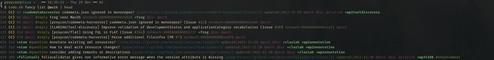
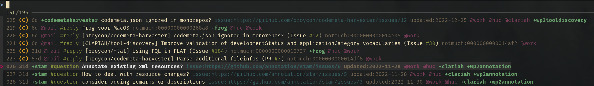
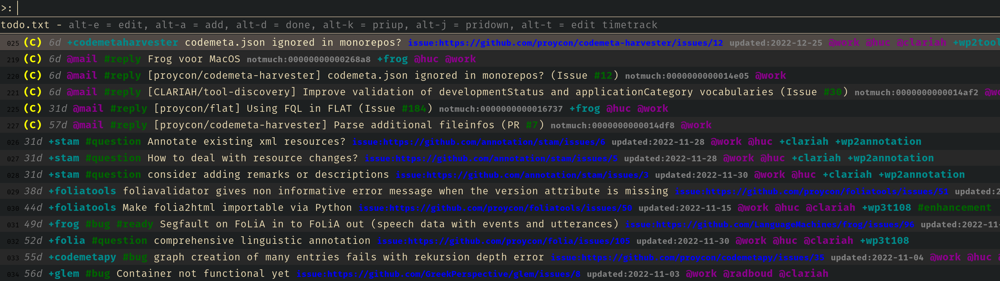
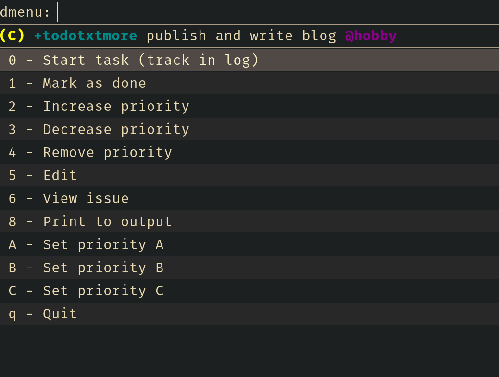

# todo.txt-more

## Introduction

This is a set of complementary extensions for todo.txt .

* `format` - Better coloured output, supports both ANSI colours as well as pango.
* `edit` - Invokes editor to edit todo.txt. 
* `show` - Show a single task based on item number
* `priup` - Priority up
* `pridown` - Priority down (up to C)
* `rofi` - Control todo.txt interactively via rofi (a menu program)
* `fzf` - Control todo.txt interactively via fzf (a terminal based fuzzy finder)
* `issue` - View and sync issues (sync with Github)
* `timetrack` - Track time on projects and contexts, and produce summary reports 
* `notmuch` - Sync with notmuch mail based on tags like 'todo' and/or 'reply' 
* `fancy` -  Better list display with sorting (`relsort`)
 
The following are usually not called directly:
* `relsort` -  Better list display with sorting
* `actionmenu` - The menu used in the fzf and rofi interfaces. 

## Installation

Run ``make install`` to copy everything to your `~/.todo.actions.d` directory.

You will need the following dependencies to use all the extra functionality this extension set offers:

* Python 3.7 or above (the extensions are written in bash but some call additional python scripts)
* [pygithub](https://github.com/pygithub/pygithub) (Arch: `python-github`, Alpine: `py3-github3`), for `issue`
* [pytodotxt](https://vonshednob.cc/pytodotxt/) (from pypi), for `issue` and `notmuch`
* [fzf](https://github.com/junegunn/fzf) (Arch: `fzf`, Alpine: `fzf`), for `fzf`
* [rofi](https://github.com/davatorium/rofi) (Arch: `rofi` or AUR `rofi-lbonn-wayland` , Alpine: `rofi` or `rofi-wayland`), for `rofi`
* [notmuch](https://notmuchmail.org/) (Arch: `notmuch`, Alpine: `notmuch`), for `notmuch`

You can run `make pythondeps` to install the python dependencies locally (uses ``pip install --user``).


## Usage & Workflow


This extension set assumes you make use of priorities A, B and C only. I use them as follows in a kind of kanban-style:

* *(A)* for tasks to do on today
* *(B)* for tasks to do later this week
* *(C)* for tasks after this week (limited)
* Tasks without a priority are the backlog 

At any time, there should only be a limited number of items carrying a priority, and it should be easy to increase/decrease priority of a task via either `priup`/`pridown`, or interactively using the `rofi` or `fzf` interfaces.

To display your tasks non-interactively, we recommend you use `todo.sh fancy` (short for `todo.sh fancy list`) rather than the traditional `todo.sh list`. It will invoke the `format` and `relsort` extensions to do better colour highlighting and better relative sorting. You can pass any arguments you pass to `list` to sort by context or project. Here is an example:



You can note the following in this example:

* todo.txt-more adds hashtags (starting with #) and will colour them differently (`todo.sh format`), context (`@`) and projects (`+`) will also get a distinctive colour.
* tasks with priority will always be shown before any items without priority (`todo.sh relsort`)
* tasks with a creation date will be shown using their relative date in days (e.g. 6d) , and sorted accordingly.
* you see tasks synced from the GitHub (issue) and from my mail (notmuch), more about this later...

If you run `todo.sh fzf list @work`, you'd the same view, but interactively using fzf, allowing you to fuzzy search.



Or run `todo.sh rofi list @work`, for the same thing in rofi, which opens a graphical menu. This is great to tie to a keybinding in your (tiling?) window manager: 



Note that your rofi may look different depending on the theme you are using.

The rofi method even binds some shortcuts keys for quick actions like prioritisation and editing. Once you select an item in either rofi or fzf, you're presented with an action menu (`todo.sh actionmenu`)



### Issue syncing

If you use Github extensively, its issue tracker is likely an important source of information for your todo tasks. However, it's cumbersome to have issues separate from your todo.txt and effectively have two systems you need to check. The `issue` extension should solve this problem. It's job is to sync issues (including pull requests) from github with your todo.txt. It will sync *all issues assigned to you*. 

The sync works as follows:

* All tasks that are issues are marked with `issue:` and the *full path* to the issue.
* A sync is done by calling `todo.sh issue sync`, in order for this to work you need to have the environment variable `$GITHUB_TOKEN` set to a Github API token.
* Any github issue that is *assigned to you* and not yet in `todo.txt` or `done.txt` will be added (without prioritisation)
* The Github repository name is translated to a project name (e.g `proycon/codemeta-harvester` becomes `+codemetaharvester`, punctuation etc is stripped and all is lowercased) and will be shown at the beginning of the task line.
* If you close a task that is also a github issue via the action menu in rofi/fzf or via `task.sh issue done`, an API call will go out to GitHub to close the issue.
* Projects may also translate to further projects or contexts, you can customize this in a JSON file and pass the JSON filename in environment variable `$TODO_ISSUE_INFERMAP`. Example:

```json
{
    "codemetapy": ["@work","@huc","@clariah","+wp2tooldiscovery"],
    "codemetaharvester": ["@work","@huc","@clariah","+wp2tooldiscovery"],
    "codemetaserver": ["@work","@huc","@clariah","+wp2tooldiscovery"],
}
```

These will all be appended to the end.

* Github labels will be added as hashtags immediately after the project name.
You can optionally translate these through another map defined in a JSON file and filename in `$TODO_ISSUE_LABELMAP`. Example:

```json
{
    "feature": "feat",
    "enhancement": "feat"
}
```

* Tasks will have a creation date corresponding to the creation data of the issue.
* An extra `updated:`  attribute is added with the last updated time. This is updated on sync.

There are a few limitations to be aware of:

* The task description/issue subject is synced from github to task.txt only once, editing it in either has no effect on the other.
* When Github labels change, they will be synced back to todo.txt (but will appear at the end when they're new). You can't sync hashtags to github labels the other way round.
* When an issue is closed and reopened, it won't be detected in the sync

### Mail syncing

Another common source of todo tasks is email. I often receive mails that require some kind of follow-up action, or that I simply have to reply to. I am using [notmuch](https://notmuchmail.org) as a means to add tags to my mail and make it quickly searchable. I use a *reply* tag for mail I still have to reply to, and *todo* for mail that requires another follow-up actions. Of course, I want both in my `todo.txt` so I have everything in one place again. 

The `todo.txt notmuch` extension syncs with your notmuch database. It runs a query (defined in environment variable `$TODOTXT_NOTMUCH_SEARCH`, which defaults to `tag:todo or tag:reply` fitting my own use-case) and adds all threads it finds to `todo.txt`. It is a one-way sync. Synced mails received the context `@mail` and the notmuch tag translates to a hashtag. Any further mappings between notmuch tags and todo.txt can be configured in a JSON file, filename stored in `$TODOTXT_NOTMUCH_MAP`. Example:

```json
{
    "work": ["@work"],
    "personal": ["@hobby"],
    "sxmo": ["+sxmo", "@hobby"],
    "folia": ["+folia","@huc","@work"]
}
```

### Time tracking

Employers often require you to tracks your working hours, especially if you a working on a variety of distinct projects. Keeping track of this manually is a waste of time. If you have your `todo.txt` workflow in place, we can simply take advantage of this for tracking time as well. This is done using `todo.txt timetrack` and it can be invoked interactively via the action menu as presented by fzf or rofi. When you say *start task* a simply eentry of the full task line, prepended with the current date and time, is registered to a file `timetrack.txt` that lives alongside your `todo.txt` and `done.txt`. Only one task can be tracked at any given time (people suck at multitasking anyway, so better not pretend you can do it). When you start a new task the previous one ends. There is also `todo.sh timetrack stop` to stop tracking, which will simply register an *idle* entry in `timetrack.txt`. I recommend to automatically trigger this action when your screensaver/screenlock kicks in so you don't have to worry about it.

To see the task you are currently working on, issue `todo.sh timetrack current`. This may be worth adding to whatever bar (waybar/polybar/dwm's bar/etc) you use so you can see it at all times.

The `timetrack.txt` log can be visualised with `todo.sh timetrack log`, it optionally takes a start date and an end date as parameters (YYYY-MM-DD). Add the `-d` option if you want to have relative time (durations), use `-s` instead if you want it in raw seconds.

Using `todo.sh timetrack daysummary` you can get a summary of total time spent, per day, on specific contexts or projects. It aggregate all projects (``+``) and contexts (`@`) mentioned in the log.

Example output:

```
$ todo.sh timetrack daysummary 2022-12-29
2022-12-29 Thu @generic 14m
2022-12-29 Thu @entertainment 14m
2022-12-29 Thu @hobby 4h44m
```


### Further usage

Once installed, see `todo.sh help` for complete usage information:

```
  Add-on Actions:
  Action menu:
    actionmenu
      Shows or processing items for the action menu, not meant to be used directly
    actionmenu [action] [itemno]
      Run the action on the item number

  Edit:
    edit [[itemno]]
      Edit the specified item in the default editor

  Fancy list:
    fancy [actions]
      Shortcut to show a fancy list with relative dates, sorting and ansi colours, can be used with any list action

  Format/recolor output:
    format [ansi|pango] [ACTIONS]
      run command and recolor using ansi or pango
    format [ansi|pango] stdin
      reads from standard input

  Fuzzy search:
    fzf [ACTIONS]
      pass list actions through fzf and make them actionable

  Handle linked issues:
    issue [[-d]] [itemno]
      view the issue referenced in the item (if any). Add -d to search in done tasks
    issue sync
      sync issues from remote
    issue close|done [itemno] ...
      close the reference issue (and mark the item as a whole as done)

  Handle linked issues:
    notmuch
      sync notmuch mails by query: tag:todo or tag:reply

  Decrease priority of item, deprioritize after C:
    show [[-d]] [itemno]
      show the task on the specified line. Add -d to search in done tasks

  Increase priority of item, using C if no priority was set yet:
    show [[-d]] [itemno]
      show the task on the specified line. Add -d to search in done tasks

  Show task by item number:
    relsort [actions]
      Convert completion dates into relative time (=days) compared to now and sort accordingly

  Fuzzy search:
    rofi [ACTIONS]
      pass actions through rofi and make them actionable

  Show task by item number:
    show [[-d]] [itemno]
      show the task on the specified line. Add -d to search in done tasks

  Timetrack output:
    timetrack start [itemno|item]
      Start tracking item (stops tracking previous one)
    timetrack stop
      Stop tracking
    timetrack current [-t]
      Show currently tracked task and the time it was started
      -t - hide the time
      -d - show relative time
      -s - show relative time in seconds
    timetrack log [[options]] [[fromdatetime]] [[todatetime]]
      (Datetime is in Y-m-d H:M:S format, time component may be omitted)
      Options:
      -d - show relative time deltas
      -s - show relative time deltas in seconds
      Note: todatetime is non-inclusive
```


